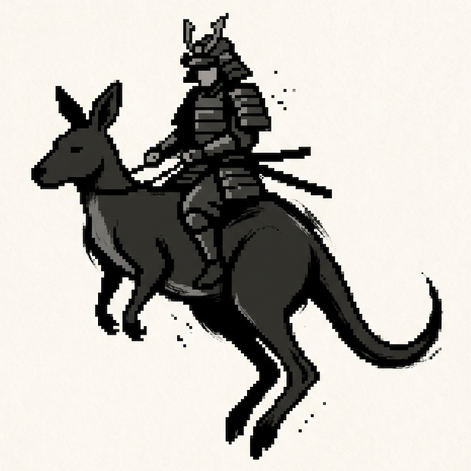

<p align="center">
  
</p>

# RooRecon

CTF and authorized-pentesting skills for **Claude Code** and **Codex** — agent
*skills* (methodology) plus *automation* (the `roo` CLI). Start an agent in this
repo and ask for recon on a box; it drives the tooling and reads the output.

## Containerized tooling

Every CLI runs in its own minimal Docker image, so scans behave the same on
Linux, macOS, and Windows. One entry point: the cross-platform **`roo` CLI**
(`scripts/roo.py`, stdlib Python) — `scripts/roo` on Unix, `scripts\roo.cmd` on
PowerShell/cmd. It builds each image on demand (tagged by Dockerfile hash) and
mounts the cwd at `/work`.

```bash
scripts/roo run nmap -sCV -p- 10.10.10.5   # runs nmap in roorecon/nmap
```

## Quick start

Drop your engagement `.ovpn` in `./vpn/` (if the target needs one), then:

```sh
claude "Run recon on 10.0.24.44"
```

## Commands

Recon: `sweep` (streaming TCP+UDP discovery) → `buckaroo` (per-port deep-dive,
surfaces hostnames) → `vhost`/`dns` (name enumeration). Post-foothold, the VPN
sidecar doubles as your box on the engagement network:

| Command | Use |
|---------|-----|
| `roo proxy up` | SOCKS5 egress — host browser/Burp/curl reach the target through the tunnel |
| `roo shell` | operator shell at the tunnel IP — reverse shells, payload hosting, impacket |
| `roo fwd <port>` | bridge a tunnel port to a host listener |
| `roo ip` | print the tunnel IP (your LHOST) |

See **[ARCHITECTURE.md](ARCHITECTURE.md)** for the design (the sidecar is a
*location*; everything else is a *tool* that runs in its namespace).

## Requirements

- **Docker** (Engine, Desktop, or OrbStack) — all tooling runs in containers.
- **Python 3** — runs the `roo` CLI (stdlib only).

## VPN targets

Drop a `.ovpn` in `./vpn/` (git-ignored) and recon the box — `roo` runs the VPN
as a sidecar container and shares its network namespace with tool containers, so
it works the same across platforms (where a container otherwise can't reach a
host `tun`). You don't touch Docker networking.

**Run only one tunnel per `.ovpn`.** HTB/THM allow a single connection per
config. A host VPN client on the same `.ovpn` fights the sidecar for the slot and
makes scans flaky (ports flip `filtered`/open). If scans look unreliable, suspect
this first — disconnect the host client and let the sidecar own the tunnel.

## Host name overrides

Containers can't see the host's `/etc/hosts`, so RooRecon keeps its own. Tell the
agent ("`box.htb` is `10.10.10.5`") or add lines to a git-ignored `./hosts`:

```
10.10.10.5  box.htb  admin.box.htb
```

`roo` mounts it into every tool container, direct or over VPN.

## Layout

```
.claude/skills/<name>/SKILL.md   # skill playbooks (auto-loaded by Claude Code)
scripts/roo.py                   # the cross-platform roo CLI
docker/<tool>/Dockerfile         # one minimal image per CLI
ARCHITECTURE.md                  # design + decisions
CLAUDE.md / AGENTS.md            # Claude Code / Codex entry points
vpn/ · hosts · recon-results/    # configs, host overrides, output (git-ignored)
```

## Authorized use only

For **CTF boxes, lab ranges, and signed-scope systems** only. Don't scan systems
you aren't explicitly authorized to assess.

## Model access (verification required)

These skills drive dual-use tooling that frontier labs gate behind verification —
models may refuse offensive tasks unless your account is verified for security
work:

- **Anthropic — Cyber Verification Program:**
  [Apply](https://claude.com/form/cyber-use-case) ·
  [Overview](https://support.claude.com/en/articles/14604842-real-time-cyber-safeguards-on-claude) ·
  [Policy](https://www.anthropic.com/aup)
- **OpenAI — Trusted Access for Cyber:**
  [Overview](https://openai.com/index/trusted-access-for-cyber/) ·
  [Verify](https://chatgpt.com/cyber)

## Credits

- **Wordlists** — [SecLists](https://github.com/danielmiessler/SecLists) (Daniel
  Miessler, Jason Haddix & contributors).
- **Tooling** — [nmap](https://nmap.org),
  [gobuster](https://github.com/OJ/gobuster),
  [OpenVPN](https://openvpn.net), each in its own minimal container.
